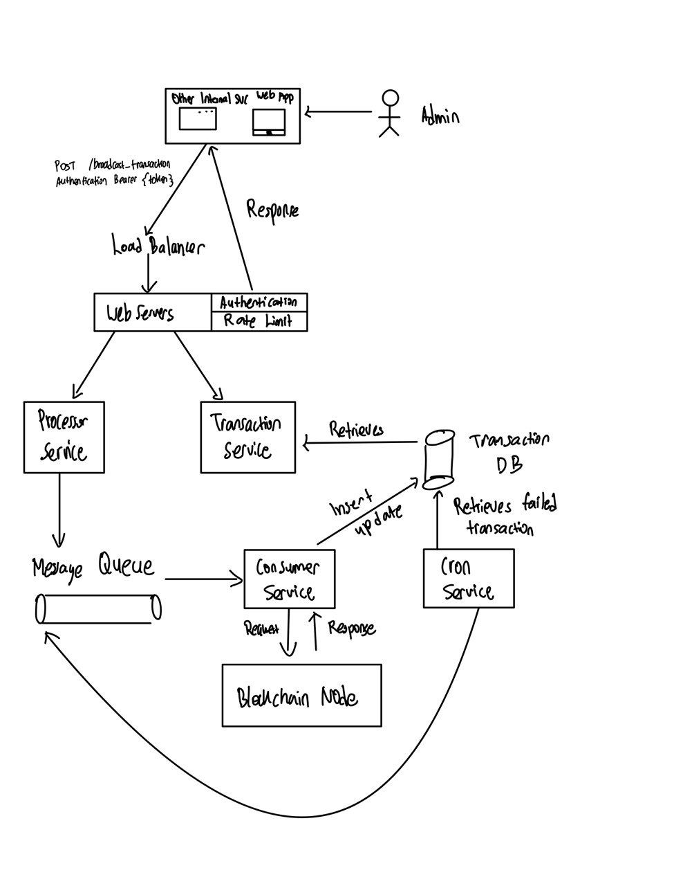

# Problem 6: Transaction Broadcaster Service

## Planning

After reading the problem statements, the best-suited architecture for the transaction broadcaster service would be **Microservice Architecture**.

Compared to a monolithic architecture, the microservices architecture could bring the following benefits:

- Allows breaking up a large application into loosely coupled modules - abiding by the Single Responsibility Principle (SRP)
- Isolation of fault
- Able to scale a deployment instead of the entire backend
- Avoid single point of failure (SOP)

These are the components identified and required to set up the transaction broadcast service:

1. Web Servers: For the services to run on.
2. Load Balancer: To efficiently distribute incoming network traffic across the different backend instances.
3. Processor Service (Backend): To broadcast the request to the blockchain node via a message queue.
4. Consumer Service (Worker + Backend): To consume the request from the message queue and broadcast it to the blockchain node.
5. Message Queue: To facilitate service-to-service communication asynchronously.
6. Database: To store the transaction records.
7. Transaction Service (Backend): To retrieve the transactions to be shown on the website page.
8. Web Application (Frontend): To allow the admin to view the list of transactions that passed or failed.
9. Cron Service (Backend): To retrieves the failed transaction and notify the other services to execute it again.
10. Blockchain Node: The evm-compatible blockchain node to broadcast to.

<div style="page-break-after: always;"></div>

## Implementation



<div style="page-break-after: always;"></div>

### Step 1: The Web Server

The web server should have the following modules:

- Authentication Module: verifying whether the requester is permitted to call a particular endpoint, typically done via Bearer Authentication.
- Rate Limit: to avoid excessive repetitive calls and prevent DDoS attack

From here, we can identify the various HTTP request codes and return a response accordingly.

- 200: Success
- 401: Unauthorized
- 429: Too Many Request

Following this, there are also 4 additional HTTP codes that could be useful:

- 404: Not Found - Used if the endpoint sent to the web servers does not exists.
- 422: Unprocessable Entity - In the scenario that the request body is invalid
- 500: Internal Error - In the scenario that the Transaction Broadcaster Service is down
- 503: Unavailable - In the scenario that the Transaction Broadcaster Service is unavailable

### Step 2: Load Balancing

Instead of allowing users via web/mobile or via other forms of internal services to call the endpoint directly, it should go through a load balancer that distributes the incoming network traffic across the different instances of the services.

To avoid Single Point of Failure, multiple load balancers could be put in place as well.

### Step 3: Processor Service

The processor service would receive the POST request and validates the request body. If the request body deems it correct, it will sign the data and output the signed transaction, which will be packaged and sent to the message queue for the `Consumer Service` to broadcast to a blockchain node.

To avoid Single Point of Failure, minimally 2 instances of the service should be running at all time.

### Step 4: Message Queue

A message queue is a form of asynchronous service-to-service communication that provides several useful communication capabilities such as RPC, Pub/Sub, Topic, Routing, and others. It is a commonly preferred method of communication in a serverless or microservices architecture compared to the traditional REST API.

In the event that the Transaction Broadcaster Service restarts or crashes unexpectedly, the message is still persistent in the queue and will be processed upon recovery.

Asynchronous interservice communication can eliminate the blocking issue. The chosen form of communication is Pub/Sub, which is able to broadcast to multiple consumers without blocking. Upon acknowledgment (ack), the web server will return `HTTP 200` to the user to avoid blocking the user from performing any other actions.

### Step 5: Consumer Service

The consumer service - acts as a message queue worker/consumer as well as a backend that primarily consumes the messages from the message queue.

Upon consumption, it will insert a transaction record into the database and broadcast the signed transaction to the designated evm-compatible blockchain network.

Since it's an RPC call, a response from the blockchain node is expected. There is a 4% possibility that a transaction would fail, which is very low.

Assumption: Since it is making an RPC call - this is a blocking process. Hence, there should be a cap on the number of retries. For this scenario, we will use an example of 3 attempts.

The Consumer Service will have a retry mechanism:

- A `counter` to capture how many times a transaction has attempted to broadcast
- If `counter != 3`, retry the RPC call
- If `counter == 3`, deemed as failed and updated the transaction record in the database.

Note that the request should be idempotent as there is a possibility that the response was delayed and not failed.

To avoid Single Point of Failure, minimally 2 instances of the service should be running at all times.

### Step 6: Database

Assumption: The database would require advanced filtering and querying. Hence the database chosen would be a SQL database.

These are some of the columns that the table should contain minimally:

```
CREATE TABLE transactions (
    signed_transaction  varchar(255) PRIMARY KEY,
    status              varchar(10) NOT NULL,
    message_type        varchar(255) NOT NULL,
    data                text NOT NULL
);
```

- `signed_transaction`: which was signed by the Processor Service - which also serves as the primary key as it will be signed with nonce, which means the signed transaction will be unique at all times, despite there might be records with the same status, message_type or data.
- `status`: can be either `pending`, `failed` or `success`.
- `message_type` and `data` should be stored to facilitate retry manually by the admin.

<div style="page-break-after: always;"></div>

### Step 7: Transaction Service

The transaction service is a backend allowing users/admins to query from the `transaction` database.

To ensure good user experience, the results should be minimally server-side paginated to return the results in either 10, 25, or 50.

To avoid Single Point of Failure, minimally 2 instances of the service should be running at all times.

### Step 8: Web Application

We can serve a page directly within Transaction Service since its role is to query from the `transaction` database.

However, the web application should ideally reside outside the web servers. This also allows the admin to retry a failed broadcast through the web application instead of manually calling endpoints via another medium.

### Step 9: Cron Service

As it is assumed that the transaction will eventually be broadcasted successfully, there might be transactions that might still fail after the 3 attempts made in the Consumer Service.

The cron service is a backend that periodically runs and queries the database to check for any failed transactions that did not go through.

Note that the service will not handle the broadcasting task but re-broadcasting the task by inserting it into the message queue for the consumer service to perform a re-broadcast.

## Potential Areas of Improvement

Optionally, the following components would be good to have but not compulsory:

1. Monitoring: This allows monitoring of the system as a whole. e.g. Prometheus and Grafana.

2. Logging: This allows monitoring of suspicious activities, such as unsolicited access to the database, and tracing of queries that caused the server to crash if any.
   e.g., PM2

3. Caching: In the scenario that there is a large amount of data from the database. Repeated retrieval from the persistent database may slow down the performance. Hence, an auxiliary database e.g. Redis, can be used as a cache. Caching such information serves to reduce load times.

4. CDN: It caches the content to its edges, allowing fast loading of the static site. Once it is cached, it allows users worldwide to access the cache files from the nearest edge location instead of retrieving them from the actual web hosting bucket. e.g. Cloudflare
